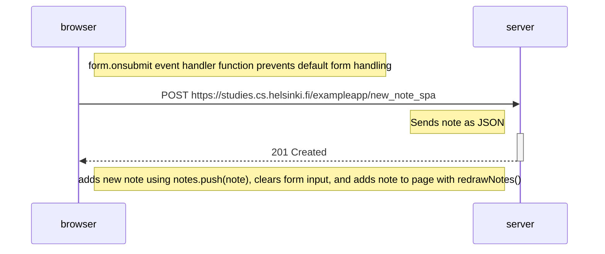

```mermaid
sequenceDiagram
    participant browser
    participant server

    Note right of browser: form.onsubmit event handler function prevents default form handling

    browser->>server: POST https://studies.cs.helsinki.fi/exampleapp/new_note_spa
    Note left of server: Sends note as JSON
    activate server
    server-->>browser: 201 Created
    deactivate server

    Note right of browser: adds new note using notes.push(note), clears form input, and adds note to page with redrawNotes()
```